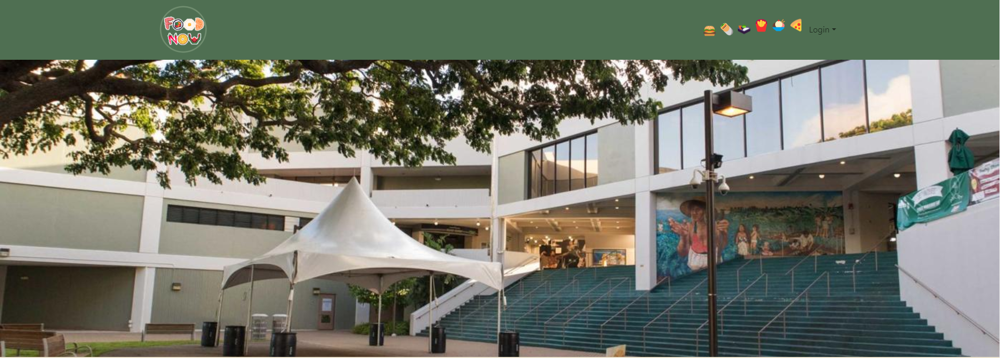

The project aimed to make a website for local food sellers at the University of Hawaii at Manoa (UH Manoa). This site connected students, faculty, and staff with different food options on campus. Users could check out vendor profiles, see menus, and order food more easily.

In the project, I had various jobs. As a developer, I designed and made important parts of the website. This included creating how the website looks and making sure it's easy for people to use. I worked closely with my team to bring our ideas to life, like making profiles for vendors and showing menus.

This experience taught me a lot about making a complicated website with many people involved. I got better at using technologies like React for how the website looks and Meteor for how it works behind the scenes. I also learned about making databases, user logins, and solving problems with a team. The project showed me how important it is to communicate well and work together in a team, especially when turning design ideas into a working website. Overall, it was a big learning experience where I could use and grow my technical skills while helping to make a user-friendly website for the UH Manoa community.

Website link: [Food Now](http://67.205.186.185/).
Github IO link: [food-now.github.io](https://food-now.github.io/).
Source Code link: [github.com/food-now](https://github.com/food-now/MM/tree/main).
